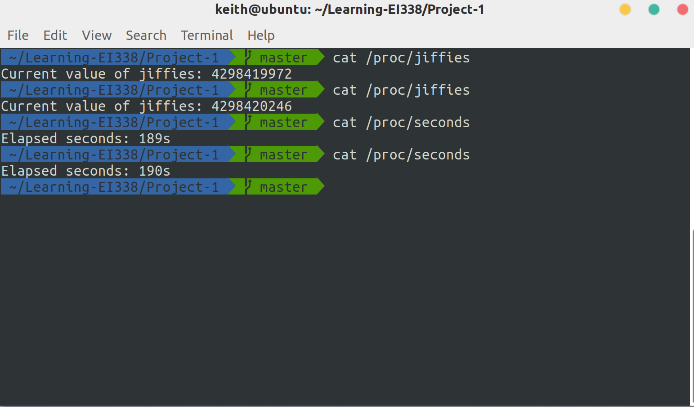

# Project 1: Introduction to Linux Kernel Modules

Introduction to Linux Kernel Modules. (Operating System Concepts, 10th Edition, Chapter 2)

## Description

This assignment will involve designing two kernel modules:

1. Design a kernel module that creates a `/proc` file named `/proc/jiffies` that reports the current value of `jiffies` when the `/proc/jiffies` file is read, such as with the command `cat /proc/jiffies`. Be sure to remove `/proc/jiffies` when the module is removed.
2. Design a kernel module that creates a `/proc` file named `/proc/seconds` that reports the number of elapsed seconds since the kernel module was loaded. This will involve using the value of `jiffies` as well as the `HZ rate`. When a user enters the command `cat /proc/seconds` your kernel module will report the number of seconds that have elapsed since the kernel module was first loaded. Be sure to remove `/proc/seconds` when the module is removed.

## Environment

- OS: Ubuntu 18.04 (Linux kernel version: 5.3.5)
- Compiler: GCC 7.4.0 

## Basic Ideas

In this project, I'm to write two kernel modules and load them into the kernel. After reading given materials and instructions, basically, I just need to modify the given C code to use `jiffies`, a variable in `linux/jiffies.h` and `HZ` in `asm/param.h`.

This project is quite easy and therefore, I don't think much explanation is needed here.

## Details

### jiffies_module.c

In this module, the only thing I need to do is to read the value of `jiffies` and report it when `/proc/jiffies` is read. The code is quite simple, adapted from the sample code:

```c
static struct file_operations proc_ops = {
    .owner = THIS_MODULE,
    .read = proc_read,
};

static ssize_t proc_read(struct file *file, char __user *usr_buf, size_t count, loff_t *pos)
{
    char buffer[BUFFER_SIZE];
    int rv = 0;
    static int completed = 0;
    if (completed) {
        completed = 0;
        return 0;
    }
    completed = 1;
    rv = sprintf(buffer, "Current value of jiffies: %lu\n", jiffies);
    raw_copy_to_user(usr_buf, buffer, rv);
    return rv;
}
```

### seconds_module.c

Based on the previous one, this module reports the elapsed time since the module gets loaded. To achieve this, simply store the value of `jiffies` when loaded and use it to calculate the elapsed time every time.

```c
unsigned long start_jiffies = 0;

static int proc_init(void)
{
    // ...
    start_jiffies = jiffies;
    // ...
}

static ssize_t proc_read(struct file *file, char __user *usr_buf, size_t count, loff_t *pos)
{
    // ...
    rv = sprintf(buffer, "Elapsed seconds: %lus\n", (jiffies - start_jiffies) / HZ);
    // ...
}
```

## Result

After compiling and loading these two modules into the kernel, we have the following results:

```bash
$ cat /proc/jiffies
Current value of jiffies: 4298419972
$ cat /proc/jiffies
Current value of jiffies: 4298420246

$ cat /proc/seconds
Elapsed seconds: 189s
$ cat /proc/seconds
Elapsed seconds: 190s
```

Or the screenshot:


