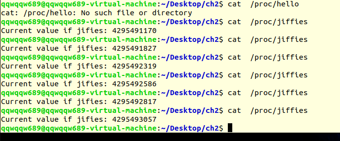

# Project 1: Introduction to Linux Kernel Modules

Introduction to Linux Kernel Modules. (Operating System Concepts, 10th Edition, Chapter 2)

## Description

This assignment will involve designing two kernel modules:

1. Design a kernel module that creates a `/proc` file named `/proc/jiffies` that reports the current value of `jiffies` when the `/proc/jiffies` file is read, such as with the command `cat /proc/jiffies`. Be sure to remove `/proc/jiffies` when the module is removed.
2. Design a kernel module that creates a `/proc` file named `/proc/seconds` that reports the number of elapsed seconds since the kernel module was loaded. This will involve using the value of `jiffies` as well as the `HZ rate`. When a user enters the command `cat /proc/seconds` your kernel module will report the number of seconds that have elapsed since the kernel module was first loaded. Be sure to remove `/proc/seconds` when the module is removed.

## Environment

- OS: Ubuntu 22.04.2 LTS
- Compiler: gcc (Ubuntu 11.3.0-1ubuntu1~22.04) 11.3.0

## Basic Ideas

In this project, I'm to write two kernel modules and load them into the kernel. After reading given materials and instructions, basically, I just need to modify the given C code to use `jiffies`, a variable in `linux/jiffies.h` and `HZ` in `asm/param.h`.

This project is quite easy and therefore, I don't think much explanation is needed here.


## Result

After compiling and loading these two modules into the kernel, we have the following results:

```bash
$ cat /proc/jiffies
Current value of jiffies: 4298419972
$ cat /proc/jiffies
Current value of jiffies: 4298420246

$ cat /proc/seconds
Elapsed seconds: 189s
$ cat /proc/seconds
Elapsed seconds: 190s
```

Or the screenshot:


