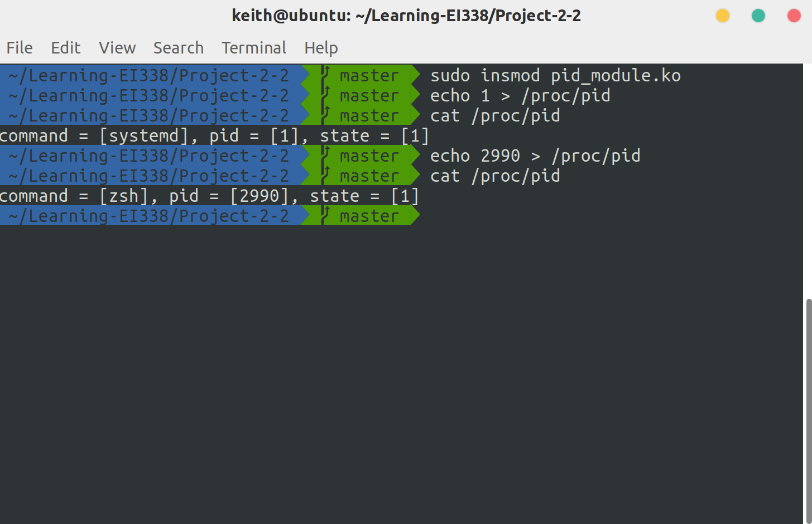

# Project 2-2: Linux Kernel Module for Task Information

Linux Kernel Module for Task Information. (Operating System Concepts, 10th Edition, Chapter 3)

## Description

In this project, you will write a Linux kernel module that uses the `/proc` file system for displaying a task’s information based on its process identifier value `pid` .

Once a `pid` has been written to the `/proc/pid` file, subsequent reads from `/proc/pid` will report

1. the command the task is running
2. the value of the task’s `pid` 
3. the current state of the task.

## Environment

- OS: Ubuntu 18.04 (Linux kernel version: 5.3.5)
- Compiler: GCC 7.4.0 

## Basic Ideas

Similar to Project 1, in the project, I need to modify the `proc_read` and `proc_write` functions in the provided code. To get a task's information in Linux, simply use`pid_task()` and `find_vpid()`. 

## Details

### proc_write()

This function is called each time we write to the `/proc/pid`.  When called, it allocates some space and reads the`pid`. Then it performs the string-to-int conversion and stores the `pid` value for future use. 

```c
static ssize_t proc_write(struct file *file, const char __user *usr_buf, size_t count, loff_t *pos) {
    char *k_mem;
    // allocate kernel memory
    k_mem = kmalloc(count, GFP_KERNEL);
    /* copies user space usr_buf to kernel buffer */
    if (raw_copy_from_user(k_mem, usr_buf, count)) {
        printk( KERN_INFO "Error copying from user\n");
        return -1;
    }
    k_mem[count] = '\0';   // make sure k_mem is null-terminated
    kstrtoint(k_mem, 10, &current_pid);
    printk(KERN_INFO "Set current PID to %d", current_pid);
    kfree(k_mem);
    return count;
}
```

### proc_read()

```c
static ssize_t proc_read(struct file *file, char __user *usr_buf, size_t count, loff_t *pos) {
	// ...
    struct task_struct *tsk = NULL;
    tsk = pid_task(find_vpid(current_pid), PIDTYPE_PID);
    if(tsk) {
        rv = snprintf(buffer, BUFFER_SIZE,
                      "command = [%s], pid = [%d], state = [%ld]\n",
                      tsk->comm, current_pid, tsk->state);
    } else {
        printk(KERN_INFO "Invalid PID %d!", current_pid);
        return 0;
    }
	// ...
}
```

## Result

After compiling and loading the module into the kernel, we have the following results:

```bash
$ sudo insmod pid_module.ko
$ echo 1 > /proc/pid
$ cat /proc/pid
command = [systemd], pid = [1], state = [1]
$ echo 2990 > /proc/pid
$ cat /proc/pid
command = [zsh], pid = [2990], state = [1]
```

Or the screenshot:


