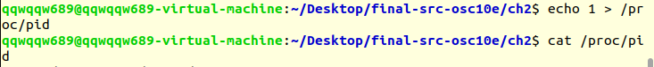

# Project 2-2: Linux Kernel Module for Task Information

Linux Kernel Module for Task Information. (Operating System Concepts, 10th Edition, Chapter 3)

## Description

In this project, you will write a Linux kernel module that uses the `/proc` file system for displaying a task’s information based on its process identifier value `pid` .

Once a `pid` has been written to the `/proc/pid` file, subsequent reads from `/proc/pid` will report

1. the command the task is running
2. the value of the task’s `pid` 
3. the current state of the task.

## Environment

- OS: Ubuntu 20.04 (Linux kernel version: 5.3.5)
- Compiler: GCC 11.3.0 

## Basic Ideas

Similar to Project 1, in the project, I need to modify the `proc_read` and `proc_write` functions in the provided code. To get a task's information in Linux, simply use`pid_task()` and `find_vpid()`. 


## Result

After compiling and loading the module into the kernel, we have the following results:

```bash
$ sudo insmod pid_module.ko
$ echo 1 > /proc/pid
$ cat /proc/pid
command = [systemd], pid = [1], state = [1]
```

Or the screenshot:


