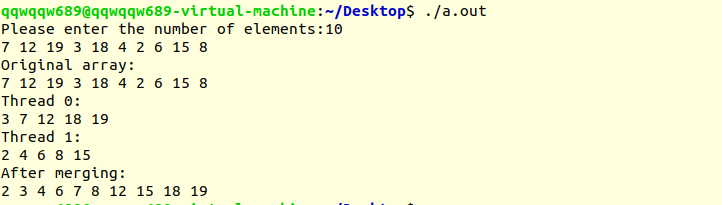

# Project 3-1: Multithreaded Sorting Application

Multithreaded Sorting Application. (Operating System Concepts, 10th Edition, Chapter 4)

## Description

Write a multithreaded sorting program that works as follows: A list of integers is divided into two smaller lists of equal size. Two separate threads (which we will term sorting threads) sort each sublist using a sorting algorithm of your choice. The two sublists are then merged by a third thread — a merging thread — which merges the two sublists into a single sorted list.

## Environment

- OS: Ubuntu 18.04 (Linux kernel version: 5.3.5)
- Compiler: GCC 7.4.0 

## Basic Ideas

The idea is quite simple: first divide the list into two sublists, each of which is then sorted by an individual thread. Then in the main thread, after waiting for these two sub-threads, do the merge.

## Details

### Sort

In this program, we have a `runner()` function, which will do the actual sorting in a single thread. So firstly, we pass the parameters from the main thread to the new threads:

```c
typedef struct {
    size_t low;
    size_t high;
} parameters;

int main(){
    // ...
	parameters data[2];
    data[0].low = 0, data[0].high = array_size / 2;
    data[1].low = array_size / 2, data[1].high = array_size;
    /* create two threads to sort the two halves of the array */
    for(size_t i = 0; i != 2; ++i) {
        pthread_create(&tid[i], &attr, runner, &data[i]);
    }
    // ...
}
```

Then in the `runner()` function, it calls the `qsort()` function to sort the sublist:

```c
int cmp(const void  *a, const void *b) {
    return *((int *)a) - *((int *)b);
}

/* The thread will do the sorting */
void *runner(void *param) {
    size_t low, high;
    low = ((parameters *)param)->low;
    high = ((parameters *)param)->high;
    qsort(array + low, high - low, sizeof(int), cmp);
    pthread_exit(0);
}
```

### Merge

After two sublists are sorted, in the main thread, we need to merge sublists to get the final sorted list:

```c
void merge_array(int *result) {
    size_t low1 = 0, high1 = array_size / 2;
    size_t low2 = array_size / 2, high2 = array_size;
    size_t i = 0;
    while(low1 < high1 && low2 < high2) {
        if(array[low1] < array[low2]) {
            result[i++] = array[low1++];
        } else {
            result[i++] = array[low2++];
        }
    }
    if(low2 < high2) {
        low1 = low2, high1 = high2;
    }
    while(low1 < high1) {
        result[i++] = array[low1++];
    }
}

int main(){
    // ...
    for(size_t i = 0; i != 2; ++i) {
        pthread_join(tid[i], NULL);
    }
    int *sorted_array = malloc(sizeof(int) * array_size);
    merge_array(sorted_array);
}
```

## Result

Here's a demo of this program's functionality:

```bash
Please enter the number of elements:10
2 0 1 9 1 0 2 9 6 6
Original array:
2 0 1 9 1 0 2 9 6 6 
Thread 0:
0 1 1 2 9 
Thread 1:
0 2 6 6 9 
After merging:
0 0 1 1 2 2 6 6 9 9 
```

Or the screenshot:

