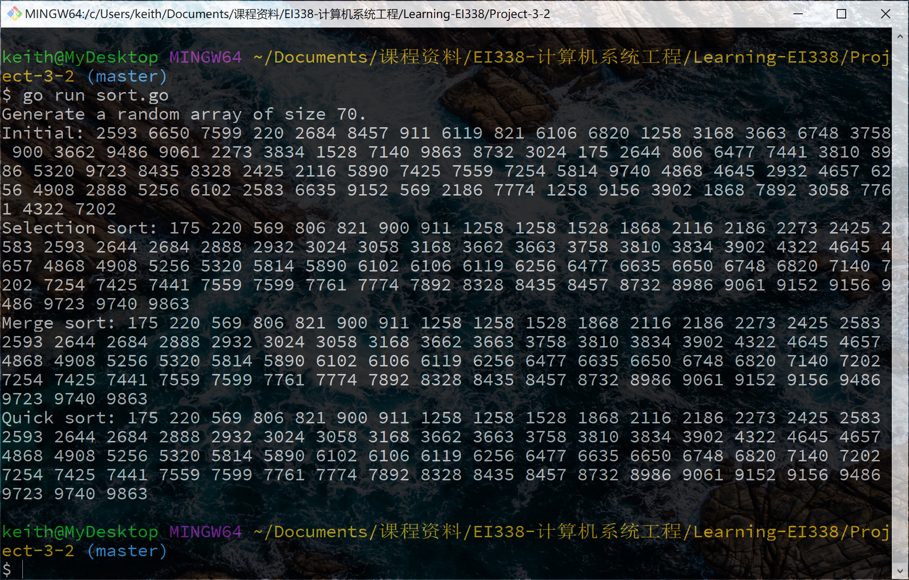

# Project 3-2: Fork-Join Sorting Application

Fork-Join Sorting Application. (Operating System Concepts, 10th Edition, Chapter 4)

## Description

Implement the preceding project (Multithreaded Sorting Application) using Java’s fork-join parallelism API (**I use Golang instead**) . This project will be developed in two different versions. Each version will implement a different divide-and-conquer sorting algorithm:

1.	Quicksort
2.	Mergesort

## Environment

- OS: Windows 10 (1903)
- Go Version: 1.13.3

## Basic Ideas

Based on single-thread quicksort and mergesort, which are implemented by recursion, the basic idea is to put such recursion into single threads.

## Details

### Quicksort

In quicksort, first choose a pivot element and divide the array into two halves. Then create another two threads to handle the subarrays. Note that we need to `wait()` the two threads to finish, otherwise it will return before subarrays get sorted.

```go
func quick_sort(arr []int) {
	if len(arr) <= THRESHOLD {
		ordinary_sort(arr)
		return
	}
	n := len(arr)
	pivot := rand.Intn(n)
	lo, hi := 0, n-1
	arr[hi], arr[pivot] = arr[pivot], arr[hi]
	for i, _ := range arr {
		if arr[i] < arr[hi] {
			arr[lo], arr[i] = arr[i], arr[lo]
			lo++
		}
	}
	arr[lo], arr[hi] = arr[hi], arr[lo]
	wg := sync.WaitGroup{}
	wg.Add(2)
	go func() {
		quick_sort(arr[:lo])
		wg.Done()
	}()
	go func() {
		quick_sort(arr[lo+1:])
		wg.Done()
	}()
	wg.Wait()
}
```

### Mergesort

In mergesort, first sort the two halves of the array in another two threads and then do the merge.

```go
func merge_sort(arr []int) {
	if len(arr) <= THRESHOLD {
		ordinary_sort(arr)
		return
	}
	n := len(arr)
	wg := sync.WaitGroup{}
	wg.Add(2)
	go func() {
		merge_sort(arr[:n/2])
		wg.Done()
	}()
	go func() {
		merge_sort(arr[n/2:])
		wg.Done()
	}()
	wg.Wait()
	var result []int
	lo1, hi1, lo2, hi2 := 0, n/2, n/2, n
	for lo1 < hi1 && lo2 < hi2 {
		if arr[lo1] < arr[lo2] {
			result = append(result, arr[lo1])
			lo1++
		} else {
			result = append(result, arr[lo2])
			lo2++
		}
	}
	if lo2 < hi2 {
		lo1, hi1 = lo2, hi2
	}
	for lo1 < hi1 {
		result = append(result, arr[lo1])
		lo1++
	}
	for i, _ := range arr {
		arr[i] = result[i]
	}
}
```

## Result

Here's a demo of this program's functionality (`THRESHOLD = 10`):

```bash
$ go run sort.go
Generate a random array of size 70.

Initial: 2593 6650 7599 220 2684 8457 911 6119 821 6106 6820 1258 3168 3663 6748 3758 900 3662 9486 9061 2273 3834 1528 7140 9863 8732 3024 175 2644 806 6477 7441 3810 8986 5320 9723 8435 8328 2425 2116 5890 7425 7559 7254 5814 9740 4868 4645 2932 4657 6256 4908 2888 5256 6102 2583 6635 9152 569 2186 7774 1258 9156 3902 1868 7892 3058 7761 4322 7202

Selection sort: 175 220 569 806 821 900 911 1258 1258 1528 1868 2116 2186 2273 2425 2583 2593 2644 2684 2888 2932 3024 3058 3168 3662 3663 3758 3810 3834 3902 4322 4645 4657 4868 4908 5256 5320 5814 5890 6102 6106 6119 6256 6477 6635 6650 6748 6820 7140 7202 7254 7425 7441 7559 7599 7761 7774 7892 8328 8435 8457 8732 8986 9061 9152 9156 9486 9723 9740 9863

Merge sort: 175 220 569 806 821 900 911 1258 1258 1528 1868 2116 2186 2273 2425 2583 2593 2644 2684 2888 2932 3024 3058 3168 3662 3663 3758 3810 3834 3902 4322 4645 4657 4868 4908 5256 5320 5814 5890 6102 6106 6119 6256 6477 6635 6650 6748 6820 7140 7202 7254 7425 7441 7559 7599 7761 7774 7892 8328 8435 8457 8732 8986 9061 9152 9156 9486 9723 9740 9863

Quick sort: 175 220 569 806 821 900 911 1258 1258 1528 1868 2116 2186 2273 2425 2583 2593 2644 2684 2888 2932 3024 3058 3168 3662 3663 3758 3810 3834 3902 4322 4645 4657 4868 4908 5256 5320 5814 5890 6102 6106 6119 6256 6477 6635 6650 6748 6820 7140 7202 7254 7425 7441 7559 7599 7761 7774 7892 8328 8435 8457 8732 8986 9061 9152 9156 9486 9723 9740 9863
```

Or the screenshot:



