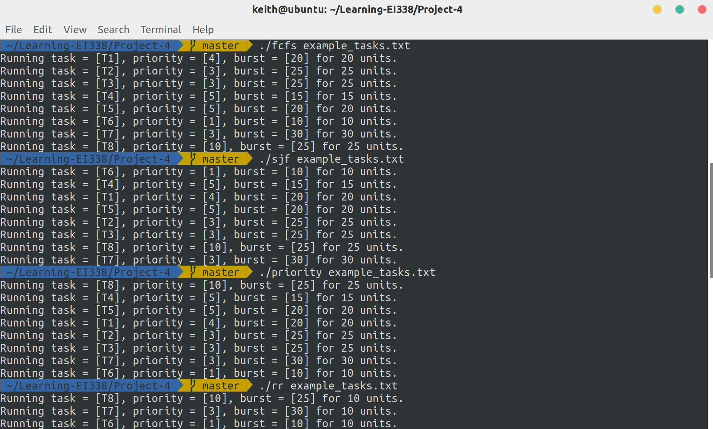

# Project 4: Scheduling Algorithms

Scheduling Algorithms. (Operating System Concepts, 10th Edition, Chapter 5)

## Description

This project involves implementing several different process scheduling algorithms, including FCFS, SJF, Priority, RR and Priority with RR.

## Environment

- OS: Ubuntu 18.04 (Linux kernel version: 5.3.5)
- Compiler: GCC 7.4.0

## Basic Ideas

With the provided code framework, simply implement each algorithm according to its definition.

## Details

### FCFS

First-come, first-served (FCFS) schedules tasks in the order in which they request the CPU. Therefore, to implement it, I just need to pick the first task in the queue, i.e., the last element in the linked list.

```c
Task *pickNextTask() {
    struct node *lastNode = taskList;
    while(lastNode->next) {
        lastNode = lastNode->next;
    }
    return lastNode->task;
}

void schedule() {
    while(taskList) {
        Task *t = pickNextTask();
        run(t, t->burst);
        delete(&taskList, t);
    }
}
```

### SJF

Shortest-job-first (SJF) schedules tasks in order of the length of the tasks’ next CPU burst. To implement it, I iterate over the list and pick the one with the shortest burst.

```c
Task *pickNextTask() {
    Task *shortest_job = taskList->task;
    struct node *n = taskList;
    while(n){
        if(n->task->burst <= shortest_job->burst){
            shortest_job = n->task;
        }
        n = n->next;
    }
    return shortest_job;
}

void schedule() {
    while(taskList) {
        Task *t = pickNextTask();
        run(t, t->burst);
        delete(&taskList, t);
    }
}
```

### Priority

Priority scheduling schedules tasks based on priority. Its implementation is quite similar to that of SJF, and the only difference is that we pick the highest-priority task.

```c
Task *pickNextTask() {
    Task *highest_priority_job = taskList->task;
    struct node *n = taskList;
    while(n){
        if(n->task->priority >= highest_priority_job->priority){
            highest_priority_job = n->task;
        }
        n = n->next;
    }
    return highest_priority_job;
}

void schedule() {
    while(taskList) {
        Task *t = pickNextTask();
        run(t, t->burst);
        delete(&taskList, t);
    }
}
```

### RR

Round-robin (RR) scheduling, where each task is run for a time quantum (or for the remainder of its CPU burst). To implement it, I maintain a variable `remaining_burst` for each task, which gets reduced each time the task is executed. When `remaining_burst` drops to zero, remove the task from the task list.

```c
Task *pickNextTask() {
    Task *ret = next_node->task;
    next_node = (next_node -> next) ? next_node->next : taskList;
    return ret;
}

void schedule() {
    next_node = taskList;
    while(taskList) {
        Task *t = pickNextTask();
        int slice = QUANTUM < t->remaining_burst ? QUANTUM : t->remaining_burst;
        run(t, slice);
        t->remaining_burst -= slice;
        if(!t->remaining_burst) {
            delete(&taskList, t);
        }
    }
}
```

### Priority with RR

Priority with round-robin schedules tasks in order of priority and uses round-robin scheduling for tasks with equal priority. To implement it, rather than only one task list, multiple task lists are used for tasks with different priorities.

```c
struct node *taskList[MAX_PRIORITY + 1];

void add(char *name, int priority, int burst) {
    Task *t = malloc(sizeof(Task));
    // allocate memory and then copy the name
    t->name = malloc(sizeof(char) * (strlen(name) + 1));
    strcpy(t->name, name);
    // priority and burst
    t->priority = priority;
    t->burst = t->remaining_burst = burst;
    // insert into task list
    insert(&taskList[priority], t);
}
```

Then when scheduling, perform the RR algorithm in the task list that has the highest priority and is not empty.

```c
Task *pickNextTask(struct node *tl) {
    Task *ret = next_node->task;
    next_node = (next_node -> next) ? next_node->next : tl;
    return ret;
}

// invoke the scheduler
void schedule() {
    // from higher priority to lower priority
    for(size_t p = MAX_PRIORITY; p >= MIN_PRIORITY; --p) {
        next_node = taskList[p];
        while(taskList[p]) {
            Task *t = pickNextTask(taskList[p]);
            int slice = QUANTUM < t->remaining_burst ? QUANTUM : t->remaining_burst;
            run(t, slice);
            t->remaining_burst -= slice;
            if(!t->remaining_burst) {
                delete(&taskList[p], t);
            }
        }
    }
}
```

## Result

With the example tasks:

```bash
$ cat example_tasks.txt
T1, 4, 20
T2, 3, 25
T3, 3, 25
T4, 5, 15
T5, 5, 20
T6, 1, 10
T7, 3, 30
T8, 10, 25
```

The output of each algorithm is:

```bash
$ ./fcfs example_tasks.txt
Running task = [T1], priority = [4], burst = [20] for 20 units.
Running task = [T2], priority = [3], burst = [25] for 25 units.
Running task = [T3], priority = [3], burst = [25] for 25 units.
Running task = [T4], priority = [5], burst = [15] for 15 units.
Running task = [T5], priority = [5], burst = [20] for 20 units.
Running task = [T6], priority = [1], burst = [10] for 10 units.
Running task = [T7], priority = [3], burst = [30] for 30 units.
Running task = [T8], priority = [10], burst = [25] for 25 units.

$ ./sjf example_tasks.txt
Running task = [T6], priority = [1], burst = [10] for 10 units.
Running task = [T4], priority = [5], burst = [15] for 15 units.
Running task = [T1], priority = [4], burst = [20] for 20 units.
Running task = [T5], priority = [5], burst = [20] for 20 units.
Running task = [T2], priority = [3], burst = [25] for 25 units.
Running task = [T3], priority = [3], burst = [25] for 25 units.
Running task = [T8], priority = [10], burst = [25] for 25 units.
Running task = [T7], priority = [3], burst = [30] for 30 units.

$ ./priority example_tasks.txt
Running task = [T8], priority = [10], burst = [25] for 25 units.
Running task = [T4], priority = [5], burst = [15] for 15 units.
Running task = [T5], priority = [5], burst = [20] for 20 units.
Running task = [T1], priority = [4], burst = [20] for 20 units.
Running task = [T2], priority = [3], burst = [25] for 25 units.
Running task = [T3], priority = [3], burst = [25] for 25 units.
Running task = [T7], priority = [3], burst = [30] for 30 units.
Running task = [T6], priority = [1], burst = [10] for 10 units.

$ ./rr example_tasks.txt
Running task = [T8], priority = [10], burst = [25] for 10 units.
Running task = [T7], priority = [3], burst = [30] for 10 units.
Running task = [T6], priority = [1], burst = [10] for 10 units.
Running task = [T5], priority = [5], burst = [20] for 10 units.
Running task = [T4], priority = [5], burst = [15] for 10 units.
Running task = [T3], priority = [3], burst = [25] for 10 units.
Running task = [T2], priority = [3], burst = [25] for 10 units.
Running task = [T1], priority = [4], burst = [20] for 10 units.
Running task = [T8], priority = [10], burst = [25] for 10 units.
Running task = [T7], priority = [3], burst = [30] for 10 units.
Running task = [T5], priority = [5], burst = [20] for 10 units.
Running task = [T4], priority = [5], burst = [15] for 5 units.
Running task = [T3], priority = [3], burst = [25] for 10 units.
Running task = [T2], priority = [3], burst = [25] for 10 units.
Running task = [T1], priority = [4], burst = [20] for 10 units.
Running task = [T8], priority = [10], burst = [25] for 5 units.
Running task = [T7], priority = [3], burst = [30] for 10 units.
Running task = [T3], priority = [3], burst = [25] for 5 units.
Running task = [T2], priority = [3], burst = [25] for 5 units.

$ ./priority_rr example_tasks.txt
Running task = [T8], priority = [10], burst = [25] for 10 units.
Running task = [T8], priority = [10], burst = [25] for 10 units.
Running task = [T8], priority = [10], burst = [25] for 5 units.
Running task = [T5], priority = [5], burst = [20] for 10 units.
Running task = [T4], priority = [5], burst = [15] for 10 units.
Running task = [T5], priority = [5], burst = [20] for 10 units.
Running task = [T4], priority = [5], burst = [15] for 5 units.
Running task = [T1], priority = [4], burst = [20] for 10 units.
Running task = [T1], priority = [4], burst = [20] for 10 units.
Running task = [T7], priority = [3], burst = [30] for 10 units.
Running task = [T3], priority = [3], burst = [25] for 10 units.
Running task = [T2], priority = [3], burst = [25] for 10 units.
Running task = [T7], priority = [3], burst = [30] for 10 units.
Running task = [T3], priority = [3], burst = [25] for 10 units.
Running task = [T2], priority = [3], burst = [25] for 10 units.
Running task = [T7], priority = [3], burst = [30] for 10 units.
Running task = [T3], priority = [3], burst = [25] for 5 units.
Running task = [T2], priority = [3], burst = [25] for 5 units.
Running task = [T6], priority = [1], burst = [10] for 10 units.
```

And the screenshot:



