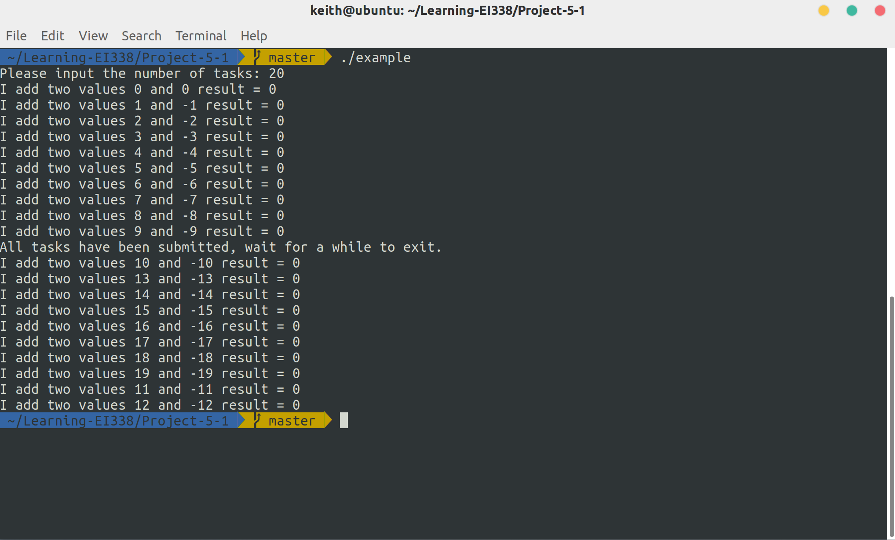

# Project 5-1: Designing a Thread Pool

Designing a Thread Pool. (Operating System Concepts, 10th Edition, Chapter 7)

## Description

This project involves creating and managing a thread pool, using Pthreds and POSIX synchronization.

## Environment

- OS: Ubuntu 18.04 (Linux kernel version: 5.3.5)
- Compiler: GCC 7.4.0

## Basic Ideas

According to the definition, a thread pool main supports two operations: initialization and submission. After initialization, when a task is submitted successfully to the pool, it will later be executed by some available thread in the pool.

## Details

### init and shutdown

To implement a thread pool, I use a mutex lock and a semaphore. The lock is used when modifying the task queue and the semaphore is to record the number of tasks in the queue.

Therefore, before using the thread pool, I need to first initialize the lock and semaphore and create multiple worker threads. Also, before exiting, remember to shut down all the threads and destroy the lock and semaphore.

```c
// mutex and semaphore
pthread_mutex_t lock;   // mutex lock for enqueue and dequeue
sem_t taskCnt;

// initialize the thread pool
void pool_init(void) {
    pthread_mutex_init(&lock, NULL);
    sem_init(&taskCnt, 0, 0);
    for(size_t i = 0; i != NUMBER_OF_THREADS; ++i) {
        pthread_create(&bees[i], NULL, worker, NULL);
    }
}

// shutdown the thread pool
void pool_shutdown(void) {
    for(size_t i = 0; i != NUMBER_OF_THREADS; ++i) {
        pthread_cancel(bees[i]);
        pthread_join(bees[i], NULL);
    }
    sem_destroy(&taskCnt);
    pthread_mutex_destroy(&lock);
}
```

### enqueue and dequeue

To avoid race condition, a mutex lock is needed when modifying the queue.

```c
// insert a task into the queue
// returns 0 if successful or 1 otherwise,
int enqueue(task t) {
    pthread_mutex_lock(&lock); // acquire lock before modifying the task queue
    if((queueTail + 1) % (QUEUE_SIZE + 1) == queueHead) {  // the queue is full
        pthread_mutex_unlock(&lock);
        return 1;
    }
    taskQueue[queueTail] = t;
    queueTail = (queueTail + 1) % (QUEUE_SIZE + 1);
    pthread_mutex_unlock(&lock);
    return 0;
}

// remove a task from the queue
task dequeue() {
    pthread_mutex_lock(&lock); // acquire lock before modifying the task queue
    task ret = taskQueue[queueHead];
    queueHead = (queueHead + 1) % (QUEUE_SIZE + 1);
    pthread_mutex_unlock(&lock);    // remember to release the lock
    return ret;
}
```

### submit

When a task is submitted to the pool, try to put it into the queue and then signal the semaphore if this succeeds. Otherwise, return the error.

```c
// Submits work to the pool.
int pool_submit(void (*somefunction)(void *p), void *p) {
    int err = 0;
    task newTask;
    newTask.function = somefunction;
    newTask.data = p;
    err = enqueue(newTask);
    if(!err) {   // success
        sem_post(&taskCnt);     // signal the semaphore
    }
    return err;
}
```

### worker

When the semaphore is available, the worker thread fetches a task from the queue and executes it. Note that `sem_wait()` also acts as a cancellation point.

```c
// the worker thread in the thread pool
void *worker(void *param) {
    // execute the task
    task workToDo;
    while(TRUE) {
        sem_wait(&taskCnt); // block until there is an available task, also as a cancellation point
        workToDo = dequeue();
        execute(workToDo.function, workToDo.data);
    }
}

void execute(void (*somefunction)(void *p), void *p) {
    (*somefunction)(p);
}
```

## Result

Here's a demo of the thread pool:

```bash
$ ./example
Please input the number of tasks: 20
I add two values 0 and 0 result = 0
I add two values 1 and -1 result = 0
I add two values 2 and -2 result = 0
I add two values 3 and -3 result = 0
I add two values 4 and -4 result = 0
I add two values 5 and -5 result = 0
I add two values 6 and -6 result = 0
I add two values 7 and -7 result = 0
I add two values 8 and -8 result = 0
I add two values 9 and -9 result = 0
All tasks have been submitted, wait for a while to exit.
I add two values 10 and -10 result = 0
I add two values 13 and -13 result = 0
I add two values 14 and -14 result = 0
I add two values 15 and -15 result = 0
I add two values 16 and -16 result = 0
I add two values 17 and -17 result = 0
I add two values 18 and -18 result = 0
I add two values 19 and -19 result = 0
I add two values 11 and -11 result = 0
I add two values 12 and -12 result = 0
```

And the screenshot:


