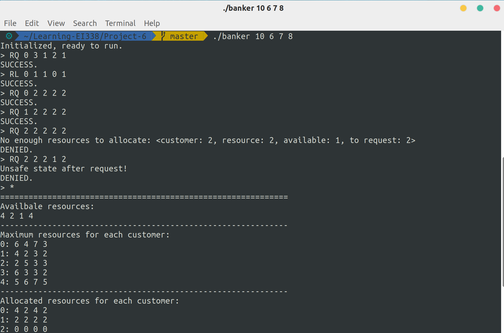

# Project 6: Banker's Algorithm

Banker's Algorithm. (Operating System Concepts, 10th Edition, Chapter 8)

## Description

In this project, I need to write a program that implements the Banker's Algorithm: customers request and release resources from the bank and the banker will grant a request only if it leaves the system in a safe state.

## Environment

- OS: Ubuntu 18.04 (Linux kernel version: 5.3.5)
- Compiler: GCC 7.4.0

## Basic Ideas

The program is mainly composed of two functions: request and release. Besides, another important function is checking whether the system is in a safe state. To implement these functions, simply follow the definition of Banker's Algorithm.

## Details

### Check the system's state

According to Banker's Algorithm, to check the system's state, I need to iteratively pick a task that can be finished without exceeding the current resources and execute it. If all tasks can be finished, then the system is in a safe state; otherwise, it's unsafe.

```c
int is_safe() {
    int work[NUMBER_OF_RESOURCES], finish[NUMBER_OF_CUSTOMERS];
    memcpy(work, available, NUMBER_OF_RESOURCES * sizeof(int));
    memset(finish, 0, NUMBER_OF_CUSTOMERS * sizeof(int));
    for(int round = 0; round != NUMBER_OF_CUSTOMERS; ++round) {
        int flag = 0;
        for(int i = 0; i != NUMBER_OF_CUSTOMERS; ++i) {
            if(finish[i] == 0 && is_leq(need[i], work, NUMBER_OF_RESOURCES)) {
                flag = 1;
                finish[i] = 1;
                for(int j = 0; j != NUMBER_OF_RESOURCES; ++j) {
                    work[j] += allocation[i][j];
                }
                break;
            }
        }
        if(!flag) {
            return 0;
        }
    }
    return 1;
}
```

### Request resources

When a customer requests some resources, first check if it's within the available resources. If not, deny the request directly. If so, then grant the request if only after the request the system is still safe. 

In my code, to avoid copy the vector, I adopt the rollback-on-error style.

```c
int request_resources(int customer, int request[NUMBER_OF_RESOURCES]) {
    int err = 0;
    for(int i = 0; i != NUMBER_OF_RESOURCES; ++i) {
        if(request[i] > available[i]) {
            printf("No enough resources to allocate\n");
            err = -2;
        }
        if(err != 0) {  // rollback
            while(i--) {
                available[i] += request[i];
                allocation[customer][i] -= request[i];
                need[customer][i] += request[i];
            }
            return err;
        }
        // allocate resources
        available[i] -= request[i];
        allocation[customer][i] += request[i];
        need[customer][i] -= request[i];
    }
    if(!is_safe()) {
        // rollback
        printf("Unsafe state after request!\n");
        for(int i = 0; i != NUMBER_OF_RESOURCES; ++i) {
            available[i] += request[i];
            allocation[customer][i] -= request[i];
            need[customer][i] += request[i];
        }
        return -3;
    }
    return 0;
}
```

### Release resources

This part is relatively easy. Also, roll back if any error occurs.

```c
int release_resources(int customer, int release[NUMBER_OF_RESOURCES]) {
    for(int i = 0; i != NUMBER_OF_RESOURCES; ++i) {
        if(release[i] < 0 || release[i] > allocation[customer][i]) {
            printf("Invalid number of resources to release\n");
            // rollback
            while(i--) {
                allocation[customer][i - 1] += release[i - 1];
                available[i] -= release[i];
            }
            return -1;
        }
        // release resources
        allocation[customer][i] -= release[i];
        available[i] += release[i];
    }
    return 0;
}
```

## Result

Here's a demo of this program:

```bash
./banker 10 6 7 8
Initialized, ready to run.
> RQ 0 3 1 2 1
SUCCESS.
> RL 0 1 1 0 1
SUCCESS.
> RQ 0 2 2 2 2
SUCCESS.
> RQ 1 2 2 2 2
SUCCESS.
> RQ 2 2 2 2 2
No enough resources to allocate: <customer: 2, resource: 2, available: 1, to request: 2>
DENIED.
> RQ 2 2 2 1 2
Unsafe state after request!
DENIED.
> *
=============================================================
Availbale resources:
4 2 1 4 
-------------------------------------------------------------
Maximum resources for each customer:
0: 6 4 7 3 
1: 4 2 3 2 
2: 2 5 3 3 
3: 6 3 3 2 
4: 5 6 7 5 
-------------------------------------------------------------
Allocated resources for each customer:
0: 4 2 4 2 
1: 2 2 2 2 
2: 0 0 0 0 
3: 0 0 0 0 
4: 0 0 0 0 
-------------------------------------------------------------
Needed resources for each customer:
0: 1 1 3 0 
1: 2 0 1 0 
2: 2 5 3 3 
3: 6 3 3 2 
4: 5 6 7 5 
=============================================================
```

And the screenshot:


