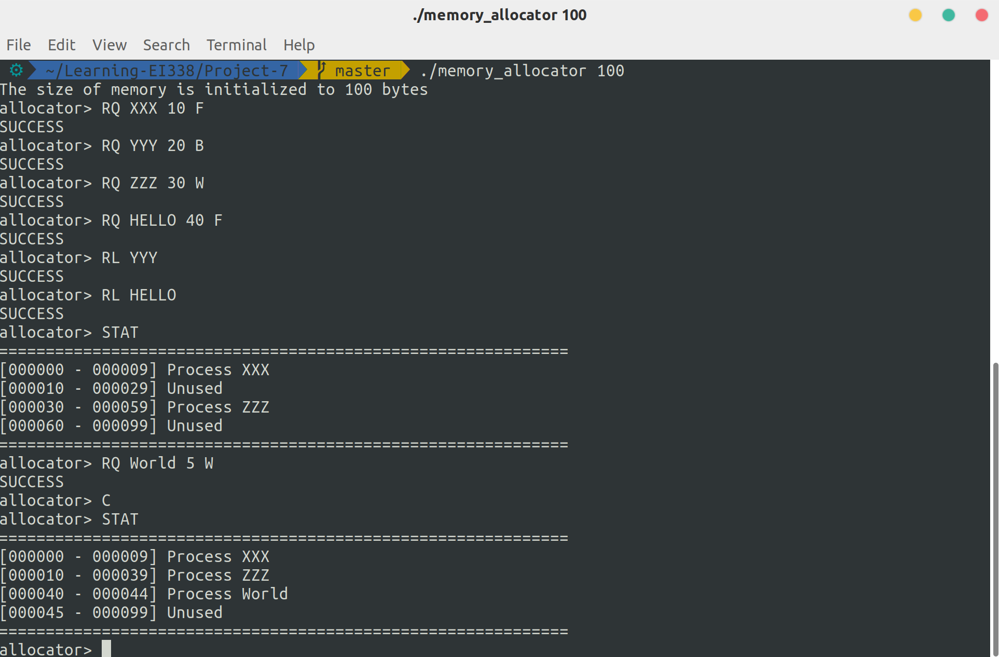

# Project 7: Contiguous Memory Allocation

Contiguous Memory Allocation. (Operating System Concepts, 10th Edition, Chapter 9)

## Description

This project will involve managing a contiguous region of memory of size `MAX` and respond to four different requests:
1. Request for a contiguous block of memory
2. Release of a contiguous block of memory
3. Compact unused holes of memory into one single block
4. Report the regions of free and allocated memory

## Environment

- OS: Ubuntu 18.04 (Linux kernel version: 5.3.5)
- Compiler: GCC 7.4.0

## Basic Ideas

To efficiently utilize memory space, I use a doubly linked list to chain memory blocks. Then request, release and compact operations are just linked list operations.

## Details

### Request

As required, three strategies are implemented to select the hole:

1. First fit: select the first hole that's large enough
2. Best fit: select the smallest hole that's large enough
3. Worst fit: select the largest hole

```c
    switch(strategy) {
        case 'F': {
            hole = mem;
            while(hole) {
                if(hole->name == NULL && (hole->hi - hole->lo + 1) >= size) {
                    break;
                }
                hole = hole->next;
            }
            break;
        }
        case 'B': {
            MemBlock *cursor = mem;
            size_t min_size = -1;   // get the max number in size_t
            while(cursor) {
                size_t hole_size = (cursor-> hi - cursor->lo + 1);
                if(cursor->name == NULL && size <= hole_size && hole_size < min_size) {
                    min_size = hole_size;
                    hole = cursor;
                }
                cursor = cursor->next;
            }
            break;
        }
        case 'W': {
            MemBlock *cursor = mem;
            size_t max_size = size - 1;
            while(cursor) {
                size_t hole_size = (cursor-> hi - cursor->lo + 1);
                if(cursor->name == NULL && hole_size > max_size) {
                    max_size = hole_size;
                    hole = cursor;
                }
                cursor = cursor->next;
            }
            break;
        }
        default: {
            printf("Unknown strategy: %c\n", strategy);
            return -1;
        }
    }
```

After selecting the hole, replace this hole with the block for this process and a smaller hole (if the requested memory is exactly as large as the hole, then no hole left)

```c
int request_memory(const char *name, size_t size, char strategy) {
    MemBlock *hole = NULL;
    // select the hole
	// ...
    if(!hole || hole->name != NULL) {
        printf("No available memory to allocate.\n");
        return -2;
    }
    hole->name = malloc(sizeof(char) * (strlen(name) + 1));
    strcpy(hole->name, name);
    if(hole->hi - hole->lo + 1 == size) {   // the hole size is exactly equal to the requested size
        return 0;
    }
    hole->next = make_block(hole->lo + size, hole->hi, "", hole, hole->next);
    hole->hi = hole->lo + size - 1;
    return 0;
}
```

### Release

Traverse all memory blocks, release those with the given name and merge unused holes when necessary.

```c
int release_memory(const char *name) {
    MemBlock *cursor = mem;
    int flag = 1;
    while(cursor) {
        if(cursor->name && strcmp(cursor->name, name) == 0) {
            free(cursor->name);
            cursor->name = NULL;    // mark it unused
            flag = 0;
        }
        // merge with the prev block if possible
        if(cursor->name == NULL && cursor->prev && cursor->prev->name == NULL) {
            MemBlock *temp = cursor->prev;
            cursor->prev = temp->prev;
            if(temp->prev) {
                temp->prev->next = cursor;
            }
            cursor->lo = temp->lo;
            free(temp);
        }
        // update the first block in memory if necessary
        if(cursor->prev == NULL) {
            mem = cursor;
        }
        cursor = cursor->next;
    }
    if(flag) {
        printf("No memory gets released!\n");
    }
    return flag;
}
```

### Compact

Two situations:

1. Current block is unused and the previous block is used, then swap these two blocks
2. Both current block and previous one are unused, then merge them into one

```c
void compact_memory() {
    MemBlock *cursor = mem;
    while(cursor) {
        // unused --> used, swap these two blocks
        if(cursor->name && cursor->prev && !cursor->prev->name) {
            MemBlock *prev = cursor->prev;
            prev->hi = prev->lo + (cursor->hi - cursor->lo);
            cursor->lo = prev->hi + 1;
            prev->name = cursor->name;
            cursor->name = NULL;
        }
        // unused --> unused, merge thees two blocks
        if(!cursor->name && cursor->prev && !cursor->prev->name) {
            MemBlock *prev = cursor->prev;
            cursor->lo = prev->lo;
            cursor->prev = prev->prev;
            if(cursor->prev) {
                cursor->prev->next = cursor;
            }
            free(prev);
        }
        cursor = cursor->next;
    }
}
```

### Report

If a block has no name, then it's unused. Otherwise, it's been used by a process with that name.

```c
void display_memory() {
    printf("=============================================================\n");
    MemBlock *cursor = mem;
    while(cursor) {
        printf("[%06zu - %06zu] ", cursor->lo, cursor->hi);
        if(cursor->name) {
            printf("Process %s\n", cursor->name);
        } else {
            printf("Unused\n");
        }
        cursor = cursor->next;
    }
    printf("=============================================================\n");
}
```

## Result

Here's a demo of this program:

```bash
$ ./memory_allocator 100
The size of memory is initialized to 100 bytes
allocator> RQ XXX 10 F
SUCCESS
allocator> RQ YYY 20 B
SUCCESS
allocator> RQ ZZZ 30 W
SUCCESS
allocator> RQ HELLO 40 F
SUCCESS
allocator> RL YYY
SUCCESS
allocator> RL HELLO
SUCCESS
allocator> STAT
=============================================================
[000000 - 000009] Process XXX
[000010 - 000029] Unused
[000030 - 000059] Process ZZZ
[000060 - 000099] Unused
=============================================================
allocator> RQ World 5 W
SUCCESS
allocator> C   
allocator> STAT
=============================================================
[000000 - 000009] Process XXX
[000010 - 000039] Process ZZZ
[000040 - 000044] Process World
[000045 - 000099] Unused
=============================================================
allocator> 
```

And the screenshot:

